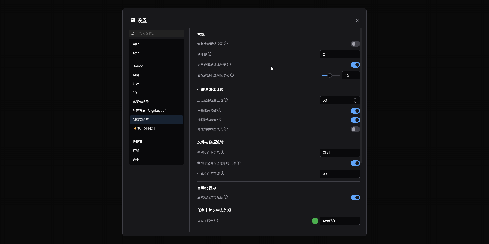

# ComfyUI-CreativeLab (CLab)

CLab (Creative Lab) 是一个为 ComfyUI 打造的沉浸式、卡片化任务管理面板。它通过完全解耦的架构，让你在不改变底层连线的情况下，像使用专业非编软件一样管理、克隆、批处理多个任务和参数组合。

<video src="https://github.com/pixixai/ComfyUI-CreativeLab/releases/download/CLab-Assets/1-overview.mp4" poster="https://www.google.com/search?q=images/1-overview.png" controls width="100%" preload="none"></video>

---
### 🏷️ 任务卡片

<video 
  src="https://github.com/pixixai/ComfyUI-CreativeLab/releases/download/CLab-Assets/2-task.mp4" 
  poster="images/2-task.png" 
  controls 
  preload="none" 
  width="100%" 
  style="border-radius: 10px; box-shadow: 0 4px 8px rgba(0,0,0,0.2);">
</video>

1. **新建任务**
    - **默认：** 在未选中任何内容时，在**任务列表**末尾添加新的“任务卡片”。
    - **选中时：** 当选中某张卡片或模块时，紧贴在**选中项**后面/下方添加“任务卡片”，并自动转移焦点。
2. **任务列表操作**
    - **选择：** 鼠标单击选择卡片；Ctrl键加选。
    - **二维矩阵连选（Shift 连选升级）：** 不仅支持同卡片内连选，还可以跨卡片进行“矩阵框选”。比如选中卡片1的模块2，按住 `Shift` 点击卡片4的模块4，系统会自动把卡片1、2、3、4里的第2到第4个模块全部选中，并且会自动隔离“输入”和“输出”类型防误触。
    - **删除：** 鼠标在“任务卡片”悬停时，点击右上角的❌️删除（多选后，点击任意“任务卡片”的❌️即可批量删除）。
    - **移动：** 鼠标拖拽移动更改排序，内置中线判定引擎（左半边前插，右半边后插）。多选后可批量平移位置。
3. **标题与进度指示**
    - **自动编号与自定义：** 每个“任务卡片”左上角都有隐藏输入框作为标题，默认是#1、#2、#3… 可点击自定义标题。
    - **标题序号自动纠偏：** 用户不需要手动去维护 `#1`, `##1` 这样的默认标题。无论是新建、删除、还是拖拽排序卡片或模块，插件都在后台静默运行了自动纠偏引擎，序号永远保持绝对的正确连贯。
    - **进度条错误警报（熔断机制）：** 任务卡片标题下方的分割线即是专属进度条。当按下运行时，它会瞬间亮起 5% 蓝条作为等待排队指示；如果 ComfyUI 运行发生报错（如图谱连线断开），进度条会**瞬间变成红色并呈呼吸灯闪烁**，同时顶部弹出 Toast 报错提示，并且会立刻**中断阻截**后续排队的其他任务，防止错误弹窗刷屏。
4. **工具栏 (卡片级)**
    - **克隆：** 完美镜像复制选中的卡片——包含内部所有模块、工具栏参数、具体参数值、以及输出模块的**历史生成记录**。多选后可批量克隆，克隆体会紧随其后生成。
    - **格式刷 (智能继承引擎)：** 吸取选中卡片内部的所有信息与排版（会自动剥离旧的历史生成图片/视频）。
        - **画在空白处 (新建)：** 像盖章一样直接新建卡片，并且 **100% 携带**原有的所有具体参数值（Value）。
        - **画在现有卡片 (覆盖)：** 仅覆盖目标的排版比例和节点绑定规则，**智能保留**目标原有的具体参数值，绝不冲掉你辛苦输入的提示词！如果目标卡片坑位不足而新生了模块，新顺延的模块则会带上格式刷的初始参数值。<功能待完善>
---

### 🧩 模块

<video 
  src="https://github.com/pixixai/ComfyUI-CreativeLab/releases/download/CLab-Assets/3-module.mp4" 
  poster="images/3-module.png" 
  controls 
  preload="none" 
  width="100%" 
  style="border-radius: 10px; box-shadow: 0 4px 8px rgba(0,0,0,0.2);">
</video>

1. **新建模块**
    - **选中卡片时：** 在其内部末尾添加空白“模块”。支持多选卡片实现**批量齐发**。
    - **选中模块时 (无界阵列并发)：** 紧贴在**每一个选中模块**的下方同步添加空白“模块”。系统内置倒序排版算法，支持跨卡片多选数十个模块，一键矩阵式生成，插入位置绝对不会错乱！
2. **模块操作**
    - **选择：** 单击任意位置选中（包括点击输入框）；支持 Ctrl 加选和 Shift 二维矩阵连选。
    - **删除：** 悬停时点击右上角❌️删除（支持多选批量删除）。
    - **平行空间同步拖拽：** 当选中不同卡片内的多个模块时，拖动其中一个模块在其**原本卡片内**上下移动（比如向下移动2格），其他卡片里被选中的模块也会在各自卡片内**同步向下移动2格**。
    - **跨卡片物理汇聚：** 当拖拽选中的多个模块离开原卡片，丢入另一个目标卡片时，这些散落在各处的模块会瞬间跨越空间，全部**聚合**插入到鼠标落点位置。
3. **工具栏 (模块级)**
    - **模块类型：** 胶囊按钮，无缝切换模块类型（输入/输出）。
    - **输入模块专属：**
        - **关联节点：** 弹出树状下拉菜单，可关联多个节点。
        - **多节点参数批量绑定：** “关联节点”和“绑定参数”下拉菜单**支持多选**。一个输入模块可以同时控制多个节点的不同参数。绑定多个后，标题栏右侧会聚合显示为 `参数名[节点ID1][节点ID2]`。
        - **拾取节点（准星图标）的左右键区分：**
            - **鼠标左键点击节点**：**替换**当前关联的节点，并自动清空之前绑定的参数，恢复初始状态。
            - **鼠标右键点击节点**：**追加**关联节点，允许多个节点同时被一个输入模块控制（右键拾取时会自动屏蔽 ComfyUI 官方的右键菜单防干扰）。
        - **Primitive（基元）节点智能穿透：** 如果用户拾取的是 `Primitive` 节点，插件不会去绑定它本身（因为它无法注入参数），而是会自动顺藤摸瓜，穿透连线找到它真实输出的那个目标节点及对应参数进行绑定。
        - **绑定参数：** 智能读取节点参数列表。根据数据类型自动变为文本框、复选框或下拉菜单。
            - **输入值防覆盖保护：** 当你使用“拾取节点”或“关联节点”重新绑定手动输入类参数（如提示词、步数）时，如果当前模块的输入框内**已经有你辛苦填写的值，系统会智能保留该值，绝不会被新节点的默认值覆盖**。
        - **媒体文件拖拽上传区 (智能变身)：** 当探测到绑定的参数是图片、视频或音频文件（如 `LoadImage`, `VHS_LoadVideo` 等带有 `upload: true` 标记的节点），输入模块会自动“变身”为一个虚线拖拽框。用户不仅可以下拉选择服务器已有的图，还可以直接将本地文件**拖拽进去**，插件会在后台静默上传并自动完成绑定。
        - **参数框高度适配：** 文本框高度根据输入字数自动撑开完整显示。
    - **输出模块专属：**
        - **关联节点/拾取节点：** 要抓取的图像或视频节点，仅支持关联一个。
        - **模块比例：** 常用画幅预设选项（16:9, 1:1 等）。
        - **宽度 / 高度：** 手动输入数值，回车确认切换至自定义比例。
        - **显示方式：** 媒体在模块内的填充逻辑（显示全部/留白、填充/裁切、拉伸/变形）。
        - **匹配媒体比例：** 勾选后自动适配运行后输出媒体的真实比例，覆盖上述设置。
        - **管理生成记录：** 点击进入历史记录网格视图模式。
    - **通用工具：**
        - **重置：** 一键清空绑定参数和设置。
        - **同步参数：** 将当前参数一键点穴同步给其他所有卡片中“标题相同”的模块。
        - **克隆 / 格式刷：** 与卡片级逻辑完全一致。克隆100%镜像拷贝；格式刷智能保留已有坑位的参数值。
4. **内容**
    - **输入模块：**
        - **标题：** 默认 ##1、##2，可点击自定义。
        - **参数值：** 传递给关键节点、绑定参数的具体参数值。
    - **输出模块：** 选中模块后，按键盘的 **`←` 和 `→` 左右方向键** 切换显示历史生成记录对比。
5. **右键菜单**
    - **内容(输出模块专属)：**
        - **下载 / 下载全部生成记录：** 提取媒体保存至本地。
        - **移除：** 仅在当前模块内移除该记录（不影响本地文件）。
        - **清除所有生成记录：** 清除当前模块的所有生成记录（不影响本地文件）。
        - **清理失效记录 (404) / 重新同步：** 提供局部的单模块死链清理与缓存击穿重载。
    - **模块：**
        - **选择相同模块：** 将所有卡片中标题相同的模块一并选中。
        - **删除相同模块：** 危险操作，一键物理删除所有同名模块。
        - **批量向后移动 / 批量向前移动：** 跨卡片统一推移同名模块的位置。

### 📥 导入

<video 
  src="https://github.com/pixixai/ComfyUI-CreativeLab/releases/download/CLab-Assets/4-import.mp4" 
  poster="images/4-import.png" 
  controls 
  preload="none" 
  width="100%" 
  style="border-radius: 10px; box-shadow: 0 4px 8px rgba(0,0,0,0.2);">
</video>

- **从剪切板导入JSON数据**
    - **创建任务：** 将数据作为新卡片追加到末尾。
    - **追加模块：** 智能追加到现有任务卡片，超出时自动新建。
    - **追加模块到选中：** 严格按 1对1 顺序追加到当前选中的卡片内。
- **从本地文件导入JSON数据**
    - 同上（创建任务 / 追加模块 / 追加模块到选中）。

### 📤 导出

<video 
  src="https://github.com/pixixai/ComfyUI-CreativeLab/releases/download/CLab-Assets/5-export.mp4" 
  poster="images/5-export.png" 
  controls 
  preload="none" 
  width="100%" 
  style="border-radius: 10px; box-shadow: 0 4px 8px rgba(0,0,0,0.2);">
</video>

- **打包为ZIP**
    - **下载全部 / 下载选中：** 仅提取当前表面正在显示的媒体。
    - **下载全部 (含所有生成记录) / 下载选中 (含所有生成记录)：** 深度遍历，将底层所有历史生成的图片/视频完整打包下载。
- **收集整理**
    - **移动 / 复制到子文件夹：** 物理移动/复制杂乱的文件到当前工作流专属归档文件夹，并重命名，自动刷新地址防裂图。
    - **移动 / 复制到子文件夹 (含所有生成记录)：** 深度遍历历史记录数组，将该模块衍生的所有媒体文件一并物理归档。
- **导出JSON数据 (点击顶部复制/下载图标操作)**
    - 输入模块 / 输出模块 / 全部模块：仅导出当前表面显示的状态。
    - 输出模块 (含所有生成记录) / 全部模块 (含所有生成记录)：包含完整的历史路径数组备份。

### ▶️ 运行

<video 
  src="https://github.com/pixixai/ComfyUI-CreativeLab/releases/download/CLab-Assets/6-run.mp4" 
  poster="images/6-run.png" 
  controls 
  preload="none" 
  width="100%" 
  style="border-radius: 10px; box-shadow: 0 4px 8px rgba(0,0,0,0.2);">
</video>

- **运行：** 智能按需隔离运行机制。
    - **选择“任务卡片”运行：** 注入输入参数，运行该卡片内所有的输出节点。
    - **选择“输入模块”运行：** 等同于选择卡片运行。
    - **选择“输出模块”运行 (动态剪枝)：** 极其省显存的局部运行，仅执行图谱中与当前选中输出模块相关的依赖节点，修剪屏蔽其他无关分支！
- **运行全部：** 将面板内所有任务卡片打包为队列，依次从头到尾接力执行。
- **运行次数（交叉循环批处理）：** 运行按钮旁边的数字输入框，执行的逻辑是**交叉循环**。例如设置为 3 次，运行卡片 A 和 B，队列执行顺序是 `A -> B -> A -> B -> A -> B`，而不是 AAA, BBB。这非常适合批量抽卡对比。

### ⚓ 数据维护与配置锚点

<video 
  src="https://github.com/pixixai/ComfyUI-CreativeLab/releases/download/CLab-Assets/7-config.mp4" 
  poster="images/7-config.png" 
  controls 
  preload="none" 
  width="100%" 
  style="border-radius: 10px; box-shadow: 0 4px 8px rgba(0,0,0,0.2);">
</video>

- **创建配置锚点：** 在画布上生成隐形的 `CLab_SystemConfig` 节点，将面板数据转化为 JSON 存入，随工作流 `Ctrl+S` 永久保存。
- **清理失效记录 (全局)：** 纯前端高并发探针，瞬间扫描全盘历史记录，自动从内存中将本地已被删除的图片“死链(404)”剔除。
- **重新同步记录 (全局)：** 它相当于一个强制刷新按钮。当你在本地硬盘用外部工具（如 Photoshop）修改了插件生成的图片覆盖保存后，浏览器因为缓存不会更新。点击此按钮，系统会强行下发时间戳（Cache-Busting）绕过缓存，瞬间在面板上加载修改后的最新画面。
- **全局媒体 404 防空洞：** 当服务器临时文件被清理或本地文件丢失导致加载失败时，插件会全自动拦截网络报错，并在原地渲染一个优雅的纯黑底色“媒体丢失”界面。彻底告别浏览器丑陋的裂开图标和干瘪黑屏。

### 🎛️ 组件 (多媒体极客控件)

<video 
  src="https://github.com/pixixai/ComfyUI-CreativeLab/releases/download/CLab-Assets/8-component.mp4" 
  poster="images/8-component.png" 
  controls 
  preload="none" 
  width="100%" 
  style="border-radius: 10px; box-shadow: 0 4px 8px rgba(0,0,0,0.2);">
</video>

- **视频组件：** 纯手工打造的无缝媒体播放器。
    - **滚轮调节进度：** 鼠标悬停在视频画面上，直接**滚动鼠标滚轮**即可高精度调节进度，左下角的时间码会变成绿色的 `分:秒:帧 (MM:SS:FF)` 格式；
    - **进度条点击跳转：**底部的绿色进度条支持点击跳转。
    - **音量条：** 鼠标悬停在喇叭图标上会向左展开音量滑杆。向左拉（远离图标）是增大音量，向右推是减小音量。在静音状态下拖动滑块会自动解除静音。如果系统探测到视频**没有音轨**，静音按钮会自动变成不可交互的灰色。
    - **其它操作：** 单击画面播放/暂停；提供独立倍速输入框（可手动输入或下拉选择）；支持一键全屏/画中画。
- **音频组件：**
    - 黑底暗绿弥散渐变的高级 UI，包含波形模拟进度条、独立音量控制与倍速胶囊按钮。
- **通用文件组件：**
    - 对于无法预览的格式（如纯文本、模型文件），自动降级渲染为带有文件标识和“点击下载”链接的极简占位面板。
- **生成记录管理-内存保护与批量操作：**
    - **缩略图性能锁：** 在“管理生成记录”的网格视图中，如果积累了几十上百个视频，不用担心卡顿。系统底层使用了 `#t=0.1` 截胡机制，缩略图只下载第一帧画面，绝不在后台播放，内存占用极低。
    - **多选与批量移除：** 在网格视图中支持 Ctrl/Shift 框选多张缩略图。选中多张后，点击任意一张图片右上角的 `✖` 按钮，即可将选中的记录**批量移除**。

### 📁 资产管理

- **文件保存流程 (事后截胡转移法)：** 无论预览还是保存节点出图，前端瞬间拦截，呼叫后端 API 将文件复制并重命名到专属的 `output/CLab` 文件夹（或您在设置中自定义的文件夹），实现所见即所得的永久归档。
- **面板数据复原流程：** 加载工作流 -> 自动读取配置锚点 JSON -> 恢复前端内存状态 -> 浏览器根据永久路径重新拉取资产展示。

### 👁️ 视图

- **纯数学布局渲染：** 摒弃原生的渲染等待延迟，卡片采用极速的纯数学公式布局推导，新建、克隆瞬间即刻排列就位，告别错位闪烁。
- **缩放视图：** 左下角的滑块，实时无缝缩放所有卡片的宽度（支持手动输入数值）。
- **复原默认视图：** 点击滑块左侧的卡片图标，一键将宽度恢复至默认尺寸。

## ⚙️ 核心偏好设置 (Settings)

CLab 提供了极为丰富的个性化选项。请点击 ComfyUI 原生设置齿轮（Settings），找到 **`Creative Lab`** 下的分组进行高度定制：

### 1. 常规 (General)

- **恢复全部默认设置**：一键将面板内的所有 CLab 选项重置为出厂状态。
- **快捷键**：自定义呼出/隐藏面板的组合键（支持单字母或 `Shift+C` 等组合键）。
- **启用背景毛玻璃效果**：开启后增加面板背后的高斯模糊高级感，适应不同用户的沉浸需求。
- **面板背景不透明度**：0~100% 的面板主背景透明度滑块调节。

### 2. 性能与媒体播放 (Performance & Media)

- **历史记录容量上限**：限制单个输出模块最多保存的生成记录数。超出后会自动剔除最旧的记录以防止内存溢出。
- **自动播放视频**：关闭后，主视频生成后仅显示首帧，点击画面才开始播放（极大减轻多图并发时的 GPU 压力）。
- **视频默认静音**：设定主视频加载时的默认静音状态。
- **高性能缩略图模式**：开启后，网格历史记录中的视频仅加载首帧，极大节省内存；关闭后，网格中的所有视频都会自动静音循环播放（适合高配机器）。

### 3. 文件与数据流转 (File & Data I/O)

- **归档文件夹名称**：自定义面板自动截胡媒体和整理文件的归档根目录（默认为 `CLab`）。
- **截胡时是否保留原临时文件**：关闭后，在把临时文件转移进专属归档目录的同时，会彻底删除原临时文件，极大地节省您的硬盘空间。
- **生成文件名前缀**：自定义截胡保存时的文件名前缀（默认是 `pix`，例如生成 `pix_01.png`）。

### 4. 自动化行为 (Automation)

- **连续运行异常阻断**：开启时，任一任务报错将立即清空所有排队任务。关闭后，系统会跳过错误任务继续执行后续生成。

### 5. 任务卡片选中态外观 (Card Appearance)

- 全方位自定义任务卡片被点击选中时的美学设计，包含：**发光强度**、**填充透明度 (%)**、**描边粗细 (px)** 以及 **高亮主题色**（默认护眼绿）。拉满发光可呈现赛博朋克风，设为 0 即为极简扁平风。

### 6. 模块选中态外观 (Module Appearance)

- 独立自定义模块（输入/输出区）被点击选中时的反馈效果，包含：**发光强度**、**填充透明度 (%)**、**描边粗细 (px)** 以及 **高亮主题色**（默认亮蓝）。

---

## 📖 更新与维护

- [📅 更新日志](web/docs/更新日志.md)

- [📘 开发指南](web/docs/开发指南.md)

- [🗺️ 开发者功能映射手册](web/docs/开发者功能映射手册.md)

- [🛡️ 多选护盾与高级拖拽](web/docs/多选护盾与高级拖拽.md)

- [🔢 运行次数与批处理机制](web/docs/运行次数与批处理机制.md)

- [📦 资产管理与状态同步原理](web/docs/资产管理与状态同步原理.md)

- [🔧 开局部微创更新重构记录南](web/docs/局部微创更新重构记录.md)

## 🤙 联系方式

如有问题请提交 Issue。

- bilibili：[噼哩画啦](https://space.bilibili.com/1370099549)

- 邮箱：pixixai@gmail.com
  
- 邮箱：pixixai@qq.com